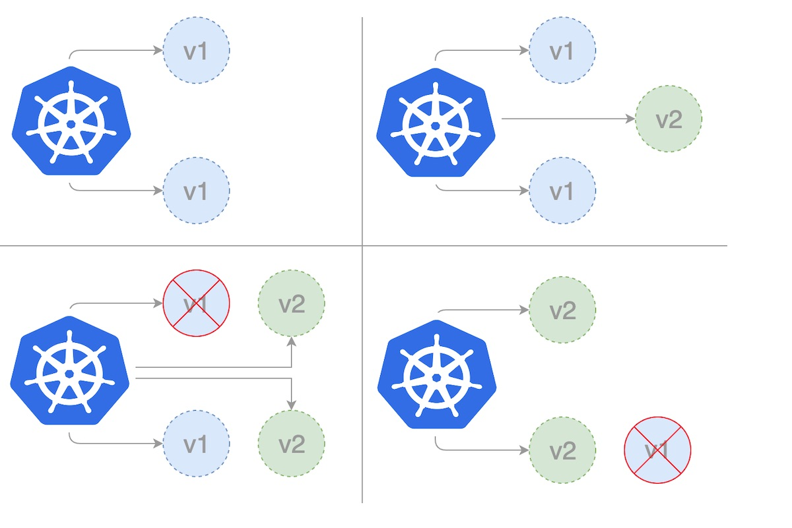

# Canary deployment demo
Canary deployments are a pattern for rolling out releases to a subset of users or servers. The idea is to first deploy the change to a small subset of servers, test it, and then roll the change out to the rest of the servers. Once the application is approved for release, only a limited number of users are routed to it, thereby minimising its impact. If there are no fails, the new version is rolled out gradually to the entire infrastructure.

## Canary deployment strategies in Kubernetes


## Step 1: Deploy V1
Release application in version 1, use image nginx：1.22，replicas is 3 
- Create Namespace
- Create Deployment
- Create Service for external access
```
kubectl apply -f deploy-1.yaml
kubectl get all -n dev
```